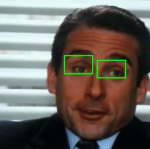

This project is a demonstration in using React with TensorFlowJS to perfrom realtime eye-detection via webcam and
client-side inference.

[Try live demo here](https://jhanmtl.github.io/eye-detector/)

Customized SSD model originally implemented in TensorFlow Python. Specialized for eye detection. 

Minimal model weights (1mb) with only one prior feature location. Based on the 14x14 feature
output map of MobileNetV2 and downsampled with additional conv2D layers until final feature map of size 7x7.

Utilizes Functional Architecture from TensorFlow Python and custom training routines based on tf.GradientTape. Training data obtained from the 
Landmark guided face Parsing ([LaPa](https://github.com/JDAI-CV/lapa-dataset)) dataset by JDAI-CV and preprocessed with on-line augmentation via tf.data API.

Upon training completion, model converted to TensorflowJS and integrated with React for realtime inference with client browser and webcam.

GPU-capable hardware recommended for optimal experience. 

